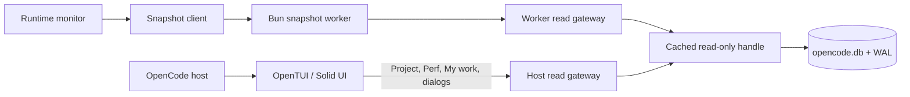
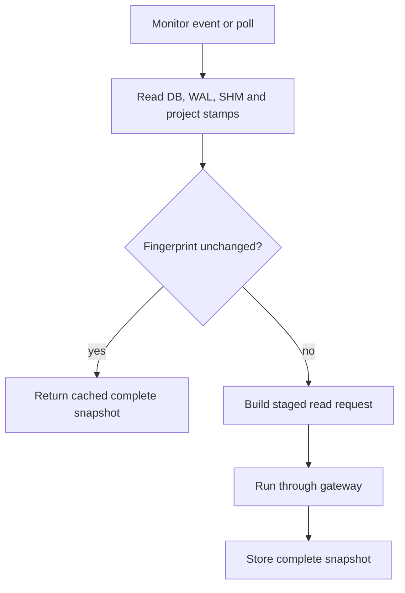
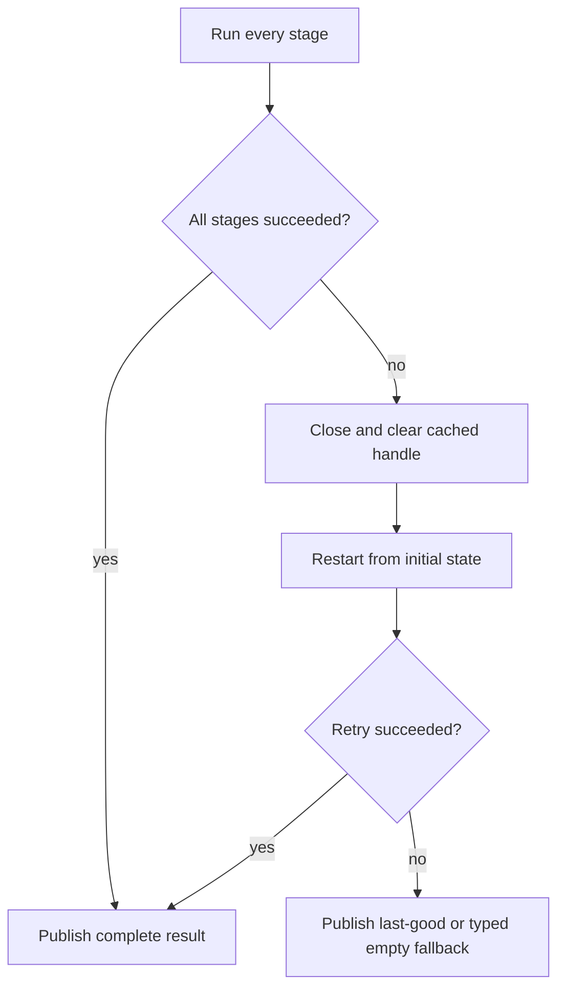

# SQLite Read Gateway

OpenCode Extended Sidebar does not use a traditional database pool. SQLite is
embedded, reads are synchronous, and OES opens the database in read-only mode.
The effective model is:

- one cached read-only SQLite handle per process and database path;
- one serialized request queue per process;
- multiple ordered stages inside a request;
- one event-loop yield between stages;
- one whole-request retry after reopening the handle;
- one atomic final result or fallback.

This design controls both UI latency and pressure on `opencode.db`. It prevents
independent panel reads from firing long runs of synchronous statements without
giving OpenTUI an opportunity to render.

## Components



The worker and host process have separate JavaScript heaps, so each owns its own
gateway queue and SQLite handle cache. The always-on runtime snapshot normally
runs in the worker. Lazy tab and dialog reads use the host gateway and yield
between stages so OpenTUI can process scheduled frames.

## Request Lifecycle

```mermaid
sequenceDiagram
  participant Caller
  participant Gateway
  participant SQLite
  participant Loop as Event loop / OpenTUI

  Caller->>Gateway: run(initial, stages, fallback)
  Gateway->>Gateway: wait for previous request
  Gateway->>SQLite: open or reuse read-only handle
  Gateway->>SQLite: stage 1
  SQLite-->>Gateway: state 1
  Gateway->>Loop: setTimeout(0) yield
  Loop-->>Gateway: resume
  Gateway->>SQLite: stage 2
  SQLite-->>Gateway: state 2
  Gateway->>Loop: yield
  Loop-->>Gateway: resume
  Gateway->>SQLite: stage N
  SQLite-->>Gateway: final state
  Gateway-->>Caller: publish final result
```

No intermediate state is published. A Project feed cannot temporarily contain
new tools with old files, and a runtime snapshot cannot expose a valid session
with tools removed because a later query was locked.

## Runtime Snapshot Layers

The runtime snapshot currently uses these stages:

1. Current session.
2. Session graph: parent, children, delegates and recent sessions.
3. Current-session tools.
4. Current-session files.
5. Session/part scan stamp used by Perf caching.
6. Targeted or project-wide open questions when reconciliation is due.

Project, Perf and OMO-aware reads use the same policy:

| Request | Stages |
|---|---|
| Project feed | tools, files |
| Perf snapshot | messages, parts, aggregation, one stage per history session |
| Perf log | messages, detailed parts, formatting after the DB request |
| My-work enrichment | writer index, one stage per approval |
| Session drafts | OMO writer lookup and filtered listing |
| Plan picker | plan file to writer-session lookup |

The number of stages is intentionally not fixed. A request may use ten or more
stages when that creates useful scheduling boundaries. A stage should represent
the smallest coherent read whose result is useful only as part of the final
request.

## Cache Path



The cache lookup happens before SQL stamp queries. An unchanged fingerprint
therefore performs no SELECT statements. Display ages and age-derived statuses
are refreshed in memory on a cache hit.

## Failure Policy



Entity resolvers are strict: SQLite errors propagate to the gateway. They do
not convert a failed tools, files, questions or todo query into an empty array.
Only the request boundary decides whether to retry or use a fallback.

For the runtime snapshot, the fallback is the previous complete snapshot when
it belongs to the same session. Other request types use a typed empty result.
A targeted question refresh preserves the previous question cache when its SQL
request fails.

## Handle Policy

`pware.oc.core.sqlite.ts` owns the physical handle:

- `bun:sqlite` is preferred and `node:sqlite` is the fallback;
- the database is opened with read-only/create-disabled options;
- `PRAGMA query_only = ON` prevents writes;
- `PRAGMA busy_timeout = 100` fails quickly under lock contention;
- the handle is reused for the same database path;
- a retry clears and reopens the handle;
- every `all()` and `get()` call is profiled as `sql`.

`SqlDb.path` is also part of OMO index cache keys. This prevents two databases
with identical `MAX(time_updated)` values from sharing a writer-session index.

## Scheduling Guarantees

The gateway yields with a macrotask boundary (`setTimeout(0)`), not a promise
microtask. OpenTUI schedules render work with Node/Bun scheduler callbacks, so a
macrotask yield gives pending timers, I/O and rendering work an opportunity to
run before the next synchronous SQLite stage.

The gateway cannot preempt a single SQLite statement. Expensive individual SQL
must still be optimized with indexes, limits and selective `json_extract` use.
The gateway solves bursts between statements and concurrent feature requests;
it does not make one slow query asynchronous.

## Ownership

| Module | Ownership |
|---|---|
| `pware.oc.core.sqlite.ts` | SQLite driver and cached physical handle |
| `pware.oc.core.sqliteGateway.ts` | queue, stage pacing, retry and fallback policy |
| `pware.oc.opencode/resolver/*` | strict OpenCode queries and read plans |
| `pware.oc.runtime/resolver/index.ts` | atomic runtime snapshot composition and last-good cache |
| `pware.oc.runtime.worker.ts` | off-thread snapshot execution |
| `pware.oc.perf.reader.ts` | staged Perf plans |
| `pware.oc.runtime.omoRead.ts` | staged OMO-to-OpenCode lookups |

Application code must not call `openReadonlyDb()` directly. It creates a read
plan or calls a gateway-backed domain API. Direct handles remain valid in tests
that exercise strict resolvers against fixture databases.
